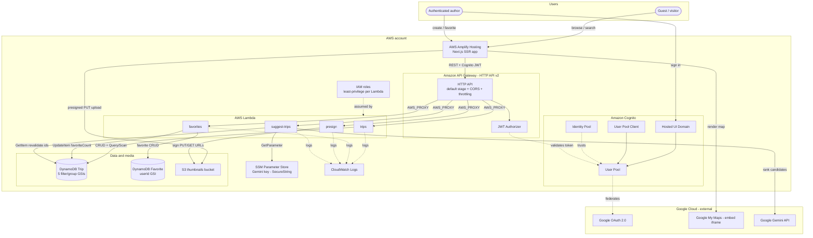
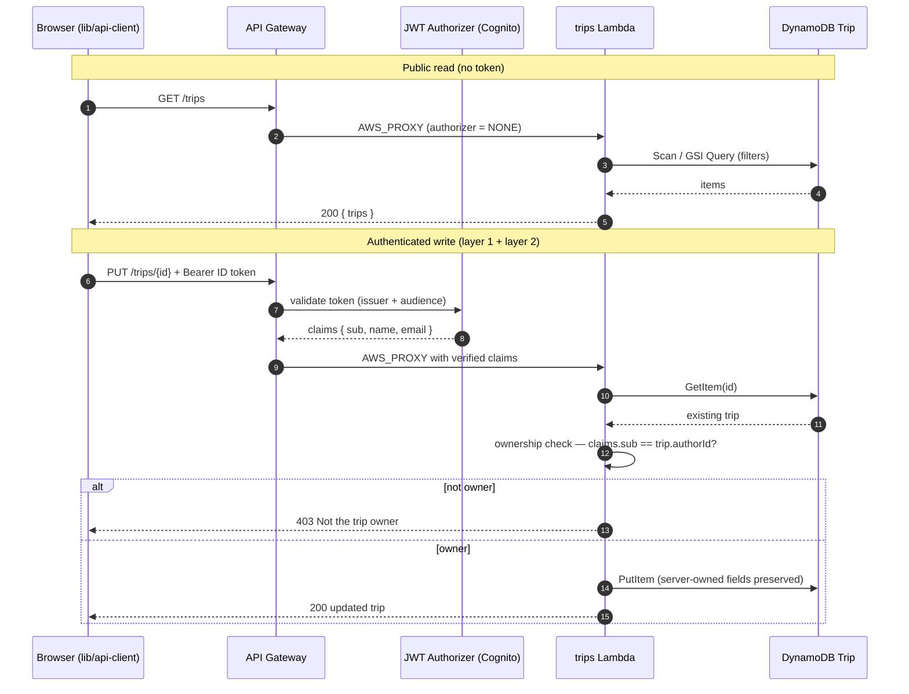
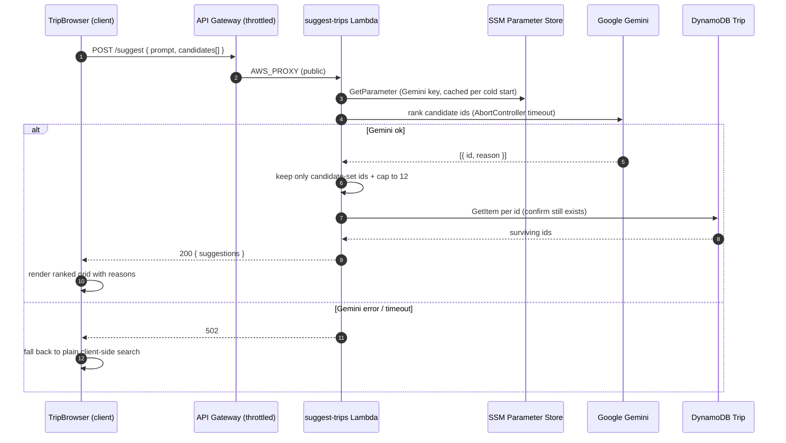
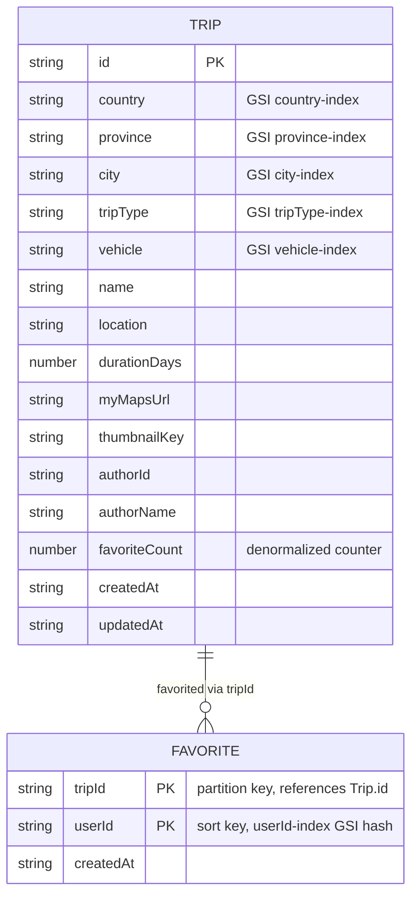
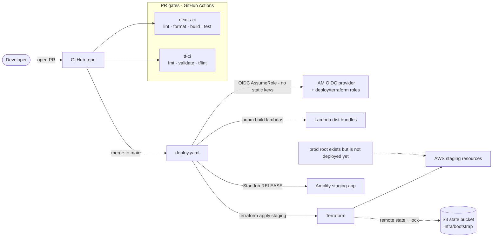

# road-rash — Architecture Diagrams

Mermaid diagrams generated from the code and Terraform on disk (2026-06-15). GitHub renders Mermaid natively; for local preview use the [Mermaid Live Editor](https://mermaid.live) or a Markdown extension.

Contents:
1. [AWS resources](#1-aws-resources-must-have) — every AWS service this project provisions
2. [Request & authorization flow](#2-request--authorization-flow)
3. [AI suggestion flow](#3-ai-suggestion-flow)
4. [Data model (DynamoDB)](#4-data-model-dynamodb)
5. [CI/CD & Terraform](#5-cicd--terraform)

---

## 1. AWS resources (must-have)

Every AWS service used, the four Lambdas, and the external Google dependencies. Mirrors `infra/modules/*` (cognito, apigateway, lambda, dynamodb, s3, ssm, hosting, iam) and the route map in `infra/envs/staging/main.tf`.

**Notes**
- **Public vs. authenticated:** `GET /trips`, `GET /trips/{id}`, `GET /uploads/thumbnail`, and `POST /suggest` carry no authorizer; all other routes sit behind the Cognito JWT authorizer.
- **Throttling:** `POST /suggest` is hard-capped (5 burst / 2 rps) to bound Gemini spend; `POST /trips` is capped (10 / 5).
- **Least privilege:** the favorites role gets Favorite CRUD + `UpdateItem`-only on Trip; the suggest role is read-only on Trip + `GetParameter` on exactly one SSM key.

---

## 2. Request & authorization flow

The two-layer authorization model (edge JWT authorizer + in-handler ownership check) for a trip edit, plus a public read.

---

## 3. AI suggestion flow

`POST /suggest` — server-side Gemini, candidate-bounded, re-validated, with a plain-search fallback on the client.

---

## 4. Data model (DynamoDB)

DynamoDB is schemaless for non-key attributes; this ER view shows the keys/GSIs and the denormalized counter. The relationship is logical (no enforced FK) — `Favorite.tripId` references `Trip.id`.

**Notes**
- `Trip.favoriteCount` is maintained by the favorites Lambda with an atomic guarded `UpdateItem` — never recomputed by scanning `Favorite`.
- `Favorite`'s composite key `(tripId, userId)` enforces one favorite per user per trip (conditional `PutItem`); the `userId-index` GSI (`KEYS_ONLY`) backs the saved-trips view.

---

## 5. CI/CD & Terraform

PR gates, the OIDC-based deploy to staging, and Terraform remote state.

---

_Regenerate these when the route map, IAM roles, data model, or deploy pipeline change. Source of truth: `infra/`, `services/`, `lib/types.ts`._
